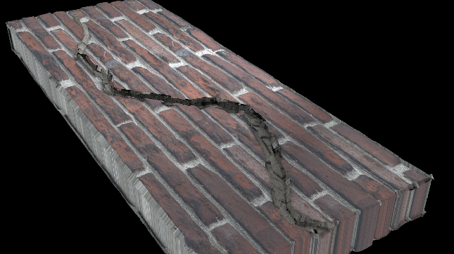
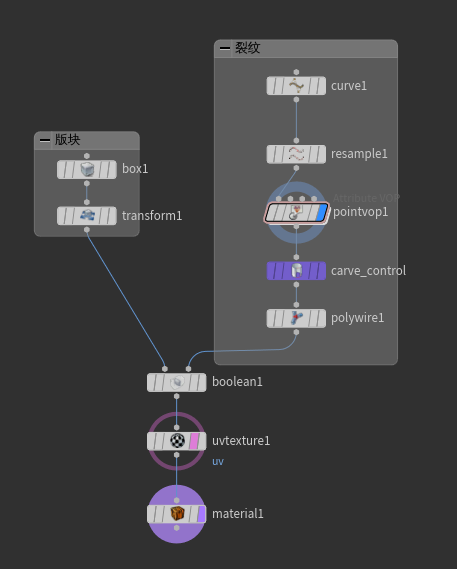
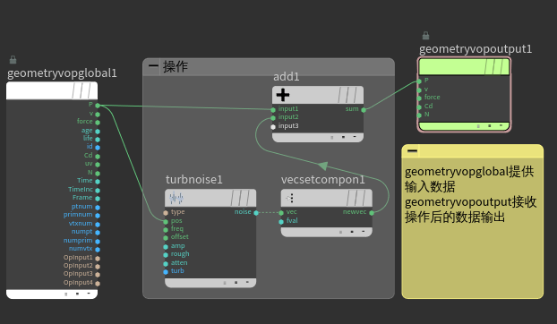
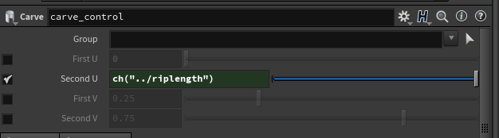

# Houdni学习——【三】裂开的墙砖
## 一、OverView
一条从板块上裂开的纹路，并在一段距离后逐渐变细。
 
 
## 二、Sop

### 2.1 Pointvop
Pointvop节点可以通过将节点连接自定义对输入数据的操作，最后传递到输出节点。

### 2.2 Carve
从图元中分割、切割或提取点或横截面。该案例中来控制裂缝的延伸程度。其U,V属性可以控制切割的方向和程度。

### 2.3 turbnoise
可以计算多种类型的一维和三维噪声，具有计算湍流粗糙度和衰减的能力。[噪声](https://blog.csdn.net/candycat1992/article/details/50346469)
- Perlin noise:[参考](https://blog.csdn.net/ZJU_fish1996/article/details/71136348)
- Original Perlin noise:与Perlin噪声相似，但计算效率较低，且具有不同的特性。当Turbulence为0时，噪声的界约为(-1，1)。
- Sparse Convolution noise:稀疏卷积噪声与Worley噪声[参考](https://blog.csdn.net/notmz/article/details/77455439)相似。返回的噪声是基于所有最近点的权重，每个点的贡献基于一个元球，如Rolloff曲线。也就是说，如果样本点靠近球体，它的贡献就会更大。当Turbulence为0时，噪声的界约为(-1.7，1.7)。
- Simple noise:[参考](https://blog.csdn.net/yolon3000/article/details/78106203)Simplex噪声复杂度的降低来源于对晶格的选取，因单形固有的性质可以使计算的梯度值大大减少从而大幅降低了计算量。
- Alligator noise:Alligator噪声与worley噪声相似。目前还不可能使用Worley函数来模拟鳄鱼噪声，但是可以得到非常类似的“外观”。当湍流为0时，噪声的界约为(0，0.5)。

>Unity最佳资源放送
<iframe src="https://api.assetstore.unity3d.com/affiliate/embed/list/top-paid/widget-medium?aid=1011l5dHP" style="width:300px; height:485px; border:0px;"></iframe>