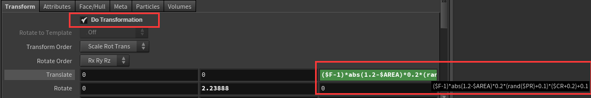

# 【案例二】Houdini消散文字制作
## 一、Overview
&ensp;&ensp;&ensp;&ensp;文字通过时间轴中frame变化而碎裂从两边开始向着中间消散并向镜头移动。

## 二、Sop(Surface OPerators or geometry nodes)

### 2.1 divide
 - 通过细分平滑. 
 - 整理多边形，三角面或四方面
 
 该案例中通过Bricker Polygons将文字font的mesh拆解为四方形。

 ### 2.2 facet
 - 控制表面的平滑度
 - 统一点或法线
 
 该案例中使用Unique Points选项来打散原本转换为四方形面的mesh，让每个小块成为独立的单元。

 ### 2.3 measure
 - 可以计算多边形的周长，面积，曲率，体积。

 该案例中通过获取它的*Area*属性来作为碎片随机移动的一个依据。同过 **$AREA**可获得它计算的面积。
 ### 2.4 attribcreate
 - 创建属性，可以复写一个节点的默认属性。
 
 该案例中使用该节点重新定义了**AREA**节点的值，使它处在一个我们期望的范围内。

### 2.5 primitive
 - 编辑原始属性、原始属性和配置曲线。

该节点可操作几何图元的基础属性，如：旋转，移动，缩放，颜色等。该案例中**primitive2**用来改变其颜色属性，并在**primitive1**中作为移动表达式的一部分。**primitive1**中使用其*DoTransformation*选项，通过自定义表达式来控制被打散图元的移动。

## 三  Function&Parameter
### 3.1 Fuc
- fit:相当于shader中remap或clamp，将一个范围映射到了一个范围。相关还有fit01,fit11,fit0。
- abs:绝对值
### 3.2 Para
- $AREA：获得measure中的面积属性
- $CR：红色通道
- $F：帧数
- $TX:X轴方向距离原点的值

 