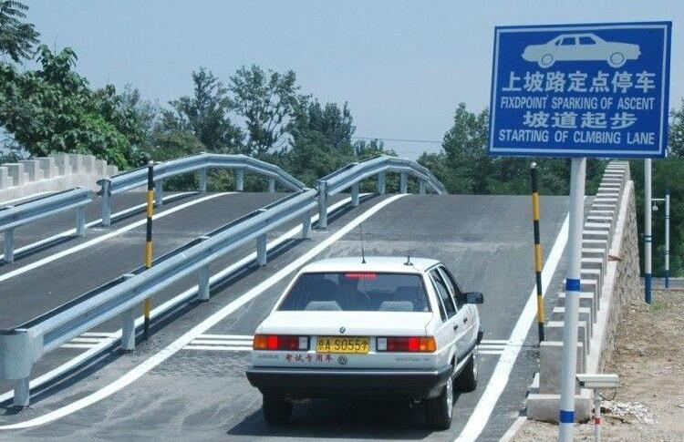

# 从科目中学习到的
> 前几天刚80分通过了科目二的考试，前前后后加上驾校跑圈也有十次了，过了心中满是喜悦，从中也得到了不少其他方面的经验，在这里和大家分享一下。
> （上班族周末班好苦逼，考试都在周内得请假，奉劝大家大学有空还是把驾照考了吧！！！！）

<!--more-->
## 交流
&ensp;&ensp;&ensp;&ensp;交流：多和教练，一起的学员尤其是已经开始模拟准备考试的学员交流。我发现在学习科目二认点位的过程中我们的理解往往和教练的有所偏差。教练说的“看到库角，立马回正”，我们有可能理解错库角到底是哪个库角，是前库角还是后库角。这个时候你有疑问一定要向教练反馈，不然需要浪费一段时间才能迷途知返。这和上学的时候一样，不怕不知道，就怕老师问知不知道装知道。“知之为知之，不知为不知，是智也。”在平时练车的过程也要和一起的学员交流，同上面一样，交流的过程中可能发现双方理解的偏差，有时也能获得一些“独门绝技”。当然，良好的沟通也能让彼此信任互相帮助。我们组练习S弯和其他项目的时候都会有副驾和后座左边的学员帮忙看又没压线，帮助练车的过程中对一些操作进行修正。最重要的，甚至比向教练请教还要重要的就是后续练车的过程中要向已经开始模拟考试的学员交流。他们往往通过模拟考试练习得到了一些重要的，有时候被教练也忽略的问题，并且他们和我们的起步位置一样，彼此更能理解。说出来可能不信，我才是考前第一次模拟跑圈的时候才从另外一个准备考试的学员那里了解到——启动车前必须会控挡，不然直接out。这一点我都练车五六次了都没有注意到，平时熄火直接踩离合钥匙打火... ...

## 分享
&ensp;&ensp;&ensp;&ensp;分享：学车的过程中一定不要吝啬，要学会分享。平时和老学员分享练车心得的过程中也能得到他们的经验分享，这样1+1>2。这又是通过性考试，不需要争个名词啥的，没必要藏着掖着。你也可以把自己学车中的点位技巧啥的和新来的或者不熟悉的学员分享，你分享的过程也是知识再次组合归纳的过程。正所谓，“赠人玫瑰，手有余香”。

## 映随
&ensp;&ensp;&ensp;&ensp;这个词不知道真的有没有还是被我创造出来的，😁。这个词的意思就是在自己的脑海中顺着有着固定步骤的这种知识技能走一遍。比如你还在等待考试的过程中可以看着一个刚开始考试的车，顺着车的轨迹假想自己在车里到了那里该做那一步，这样一步步下来。就和沙盘演兵一样，也可以称为灵魂出窍😁这种方式来复习和应试前准备很适合那种操作型技能。复习的过程中无车亦有车，你坐在家里凳子上都能飘逸了[]~(￣▽￣)~*。用这种方式来做应试准备也得心应手，可以方式直接上去手忙脚乱，你回忆的过程中也分担了一部分思考，缓解考前紧张。

## 取舍
&ensp;&ensp;&ensp;&ensp;再次提一点，驾照只是一个通过性考试，不是高考那样非要那个名次高分不可，有的时候一些细节可适当的取舍。如果你倒库已经百分百过了没有扣分，半坡30公分那里为了不压线完全可以适当的放松加大距离。如果放弃10分能让压线百分百挂的概率降低80%，那么这10分还是值得放弃的。就科目二挂了的项目来说倒库和半坡起步站的比例非常巨大，而且半坡问题主要是在熄火和溜坡。这样我们就有足够的理由来在倒库没扣分的情况下放弃倒库30cm边线者十分，而把注意力放在半坡的起步上。

>最后祝每一位考科目二的考生一把过，都成为开车大神，安全熟练的上路🚀