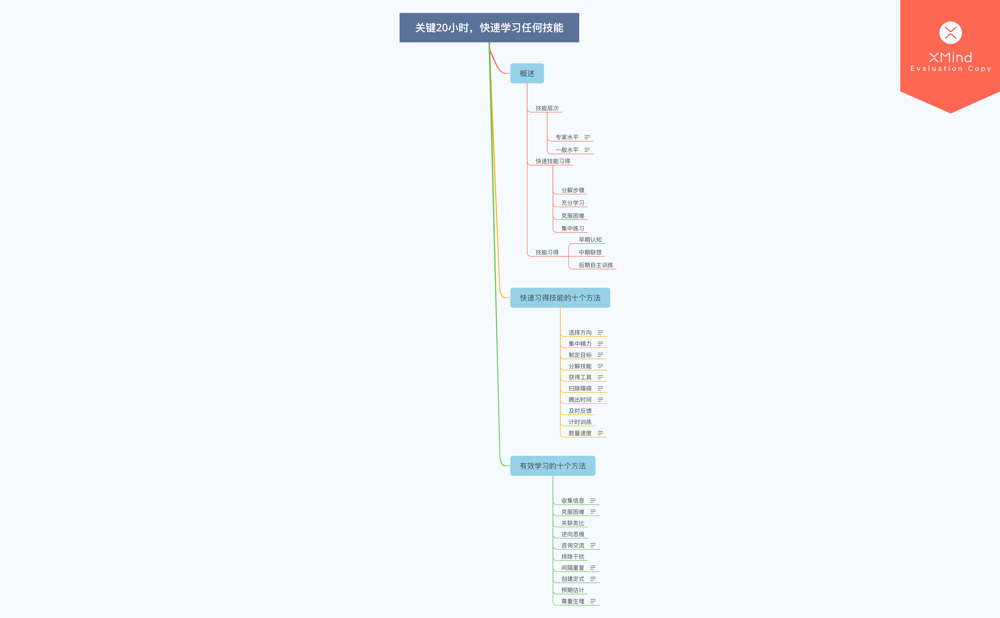

>第一次用hexo发表博文，有点小欣喜😀
# 关键20小时，快速学习任何技能
** **
*通过学习该部分，你将会在以后的技能学习中披荆斩棘*
<!--more-->
## 概述

### 技能层次
#### 专家水平
刻意练习10000h定律:在自己需要深入的领域投入10000小时，你才能成为该领域的专家。
#### 一般水平
快速学习 20h:通过一定的学习技巧，快速习得一门新技能，达到一般水中。

### 快速技能习得
1.  分解步骤
2.  充分学习
3.  克服困难
4.  集中练习
### 技能习得阶段
1.  早期认知
2.  中期联想
3.  后期自主训练
## 快速习得技能的十个方法
### 1.选择方向
快速技能习得，所以优先学习自己感兴趣的事，学习速度更快。比如你对口琴学习很感兴趣，那就投入精力去学习，肯定比你学习无感的事要快得多。

### 2.集中精力
既想学口琴，又想学网络编程，还想把shader学好，还想把建模学好，现在又在学习驾照... ...重要紧急，重要不紧急，紧急不重要，不重要也不紧急快速完成重要紧急的，不拖延重要不紧急的，放下紧急不重要的，忽视即不重要也不紧急的

### 3.制定目标
学习目标的制定有利于我们对预期目标做到心中有数，有利于我们最终学得足够优秀。明确的学习目标，有助于我们针对性的训练，不至于盲目。

### 4.分解技能
把关键的步骤先找出来，再集中时间和精力去学习。

### 5.获得工具
工欲善其事，必先利其器。

### 6.扫除障碍
. 外部环境：克服或是换个环境。
.  内部情绪：积极暗示，沉浸遗忘。

### 7.腾出时间
达到20小时这个初级训练目标。

### 8.及时反馈
获得及时的反馈可以帮助人们准确了解对技能的掌握情况，少走弯路，及时调整自己的学习方式。我们不能等着菜都烧糊了才记得添水，稍微闻到焦味就应该降低火温添水。
### 9.计时训练
计时可以帮助人们稳定达到一定的训练强度。可以给自己设置个番茄钟，分段训练。当量变达到质变的时候，相信你也能看到自己的显著进步。
### 10.数量速度
别去设想有完美的表现，保持良好状态的同时，保证训练量和训练速度才是最应该考虑的。

## 有效学习的十个方法
### 1.收集信息
尽可能快地了解重要的基础技能、关键步骤以及必要的学习工具。

### 2.克服困难
初期困难大，压力多。随着技能实践的不断深入，你会慢慢解决这些疑惑，最终理解这门技能。

### 3.关联类比
### 4.逆向思维
### 5.咨询交流
在投入时间和精力学习新技能前，有必要和内行聊一聊。这样我们可以提前预知技能训练的每个阶段会遇到的情况，从而消除对技能学习的疑虑和误解，使我们在技能训练的过程中不但不会灰心丧气，反而会更有兴趣坚持下去。

### 6.排除干扰
### 7.间隔重复
遵循记忆曲线规律，达到长期记忆。

### 8.创建定式
比如操作型的技能学习。通过分解成为固定的步骤，定式学习流程，甚至通过内心演练，可以帮助人们更快的获得它。

### 9.预期估计
### 10.尊重生理
人是铁，饭是钢，睡觉是保障。良好的身体条件和精神是高效学习学习必不可少的保障。🍅番茄时钟就是一种很好的学习调节方式。当然个人可以依据自己的情况调节学习和休息的比例。

