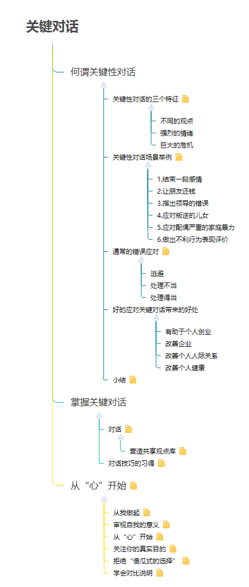
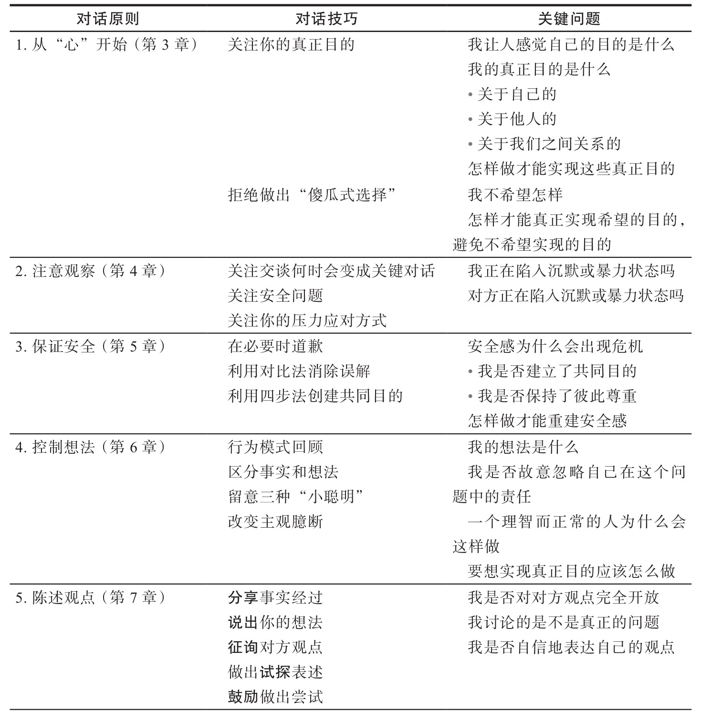
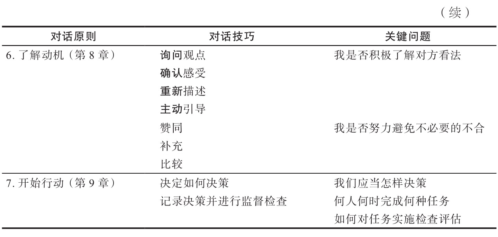

> &ensp;&ensp;&ensp;&ensp;《关键对话》将帮助你以四两拨千斤的方式，利用各种沟通技巧，解决生活中难以应对的各种难题，成就无往不利的事业并拥有更快乐的人生。
&ensp;&ensp;&ensp;&ensp;本书详细剖析了人们在沟通上常见的盲点，并提供了许多立竿见影的谈话、倾听、行动技巧，辅以丰富的对话情境和轻松幽默的小故事，帮助读者以最迅速的方式掌握这些技巧。
&ensp;&ensp;&ensp;&ensp;说的切中要点，让对方清楚知道你的看法，是一种能力；说的圆满得体，让对方自  动反省，是一种智慧。运用本书提供的技巧，不论是多么难以应对的局面，你都能够以事半功倍的效率轻松面对。

<!--more--->
[我的小站](http://junmx.tk/)

# 1.何谓关键性对话

## 1.1.	关键性对话的三个特征
1.1.1.	不同的观点
1.1.2.	强烈的情绪
1.1.3.	巨大的危机
## 1.2.	关键性对话场景举例
关键性对话往往出现在重要的场合，此时更应该理性处置。
1.2.1.	1.结束一段感情
1.2.2.	2.让朋友还钱
1.2.3.	3.指出领导的错误
1.2.4.	4.应对叛逆的儿女
1.2.5.	5.应对配偶严重的家庭暴力
1.2.6.	6.做出不利行为表现评价
... ...
## 1.3.	通常的错误应对
逃避只能逃避对话，逃避是逃避不了问题的。当我们意识到事态已经升级到关键性对话的时候，沉默往往会造成惨痛的代价。这些代价可能时间上的错失，也可能空间上的隔离。既然问题可以通过对话来解决，那么人们更应该去面对它。就算退一步，对话处理不当，也强过丧失对话的机会。放弃逃避才能在处理不当和处理得当间得到结果。
1.3.1.	逃避
1.3.2.	处理不当
1.3.3.	处理得当
## 1.4.	好的应对关键对话带来的好处
1.4.1.	有助于个人创业
1.4.2.	改善企业
1.4.3.	改善个人人际关系
1.4.4.	改善个人健康
相信每个人都体验过不良的关键对话带内心负面的影响，大家也都明白内心的愉悦与安宁对身体意义。
## 1.5.	小结
当结果充满风险,观点背道而驰，双方的情绪激烈时，普通的对话会升级为关键对话。尽管关键对话对人们意义重大，但是往往应对容易偏差。事实证明，逃避对话或是把对话搞砸都会带来灾难性的后果。所以在后续的章节学习中我们将会学习如何应对关键对话。
# 2.掌握关键对话
## 2.1对话
关键对话首先要对话，要摒弃沉默，放下芥蒂，平等尊重的和对方交流。
### 2.1.1营造共享观点库
共享观点库是实现协同效应的前提。共享观点库不但能够帮助个人做出更好的选择，更能是人们团结起来。
## 2.2 对话技巧的习得
关键对话技巧轻松易学，当人们意识到关键对话的重要性，并产生这种积极观念的时候，就能够将学习到的知识应用其中。
从不回避问题，坦率说出内心的想法，努力营造诚实和尊重对方的对话气氛。
# 3. 从“心”开始
## 3.1从我做起
当我们意识到对话产生了分歧，产生了可预见的不好的走向。我们首先要从自己身上找原因，这样才能最快的让对话重新回到理性。我们需要明白的是这种自我审视不是逃避，更不是放弃，而是为了对话能够积极的进行。“两头牛要过河，不想让，扑通扑通掉下河”。
## 3.2审视自我的意义
审视自己是有积极意义的，既然我们不能改变他人，那么我们应当尝试先去改变自我。“富人会加倍的努力，而贫穷者已经习惯了得过且过”。
## 3.3从“心”开始
对话高手总是从“心”开始的，他们总是明确目的和动机，不会让对话走向歇斯底里。
首先，他们清楚的知道自己想要通过对话获得什么。
其次，他们从不做出“傻瓜式的选择”（非黑即白，和稀泥）。
## 3.3 关注你的真实目的
大多数时候对话的目的不是为了冲突而是为了一定的目的。但是往往不恰当的处置方式让对话的双方被基因所左右，忽视了自己本来的目的，演化成为争吵，暴力，冷战等。
 1. 寻求你对话的意义。 
 2. 控制好你的身体。 
 3. 清楚自己为了实现意义需要做出什么选择。
 ## 3.4拒绝“傻瓜式的选择”
不要让肾上腺素让你失了智，得了急。充血的大脑思维会变得狭隘，无法做出正确的选择。我们需要清楚地明白，问题的解决方式并不是不是你死就是我亡，非黑即白，不对即错。此时需要控制自己的理性，做出第三种选择，做到两全其美。
## 3.5学会对比说明
 1. 阐明自己目的。 
 2. 说明你不想实现的目标。
 3.  给自己提出一个更复杂的问题。

跳出暴力或者沉默的怪圈，寻找更富有创造力和建设性的选择。
# 4.注意观察
## 4.1留意对话气氛
**对话陷入危机的时刻：**
1. 生理信号：胃部不适，双眼发干，身体紧绷（命令自己暂时后退，放慢节奏，认真审视自己）
2. 情绪信号：害怕，受伤，愤怒...（控制情绪，回归理性）
3. 行为方式：提高嗓门，指手画脚或是异常安静（调节行为）

**对方失去安全感的信号：**
只有在安全的对话气氛中，你才可以畅所欲言。
人们不会因为你表达的内容感到气愤，他们表现出抵触的情绪是因为在对话中失去了安全感。
失去安全感时，对方善意的话语也会被你当作威胁。
信号：
沉默和暴力：演示、逃避、退缩，压迫，控制，威胁，口出秽语，贴标签，人身攻击。
**自己应对压力的方式：**
留意自己错误应对的方式会在什么时候出现，并在后续的对话中可以避免。
# 5.保证安全
## 5.1暂停对话，营造安全感，返回对话
共同目的——对话启动因素
相互尊重——对话持续因素
## 5.2暂停对话后该怎么做
1.道歉
2.对比说明
3.创建共同目的
 - 积极寻找共同目的：我们必须开放思维，寻找第三种解决方式——双方都能够满意。 		 		
 - 识别策略背后的目的 ：下班回家女友说想去看电影，男的说想在家休息。通过沟通得知二人背后的目的分别为女的想和男友亲密一下，男的想离开喧闹的人群安静下。最终他们统一了分歧决定去峡谷看风景。
我们不能只停留在言语本身，而要抓住背后的真意。
 - 	开发共同目的：知道对方隐藏的目的后，也许会意识到双方的目的存在共通之处。即使为了目的同意提高了目的的层次和跨度，也要比一时的妥协和分歧好。

4.和对方共同构思新策略
- 现在开发了共同目的后，双方可以返回对话，共同寻找能够满足共同目的新策略。
# 6.控制想法
## 6.1情绪并非无中生有
- 情绪并非别人强加给你，是你自己产生的
- 负面情绪产生后要么控制它，要么被他控制
## 6.2控制想法的技巧
### 6.2.1行为方式回顾
1. 关注你的行为表现
2. 确定行为背后的感受
3. 分析感受背后的想法
4. 寻找想法背后的事实
5. 留意三种常见的小聪明：
- 受害者思维——“我才是受害者，这可不是我的错”：不要掩饰和逃避自己的责任。
- 大反派——“都是你造成的”：不要过分强调对方的错误和愚蠢，歪曲事实只能增生芥蒂。
- 无助者——“我也没办法”：看似减少自己的利益损失，实则扩大了后续的损失。这样的影响往往和“傻瓜式的选择”差不多。
### 6.2.2改变主观臆断
不要再没有沟通，没有获得足够的信息之前就先入为主，盲目的主观臆断会蒙蔽人们的理性。你可以有假设，有自己的想法，但不要让这种思维排斥后续的对话交流中信息的获得。
# 7.阐述观点
## 7.1分享争议观点
坦率，真诚。对话的目的在于解决问题，想要解决那就从分享争议问题开始吧。
## 7.2维持安全感
- 自信:自信可以让我们去开展对话，让对方倾听。自信也能让我们勇敢的去面对问题，去坦率的沟通，让对方不会受到伤害和冒犯。
- 谦逊:上述的自信不代表狂傲自大，我们既要自信的去对话，也要谦逊的去倾听，去认识到对话的初衷，不至于自说自话。
- 技巧:这也是这本书的目的，对话也需要遵循一定的技巧，这样我们就能在今后的关键对话中得心应手。
## 7.3综合陈述法
- 分享事实经过:从最少的争议，最有说服力的事实谈起。
- 说出你的想法:说明你根据事实得到的结论。
- 征询对方意见:鼓励对方说出他们看到的事实和产生的想法。
- 做出试探表述:承认这些结论只是你的想法，不要假装其是事实。
-鼓励做出尝试:创建安全感，鼓励对方说出不同甚至对立的观点。
# 8.了解动机
## 8.1了解对方的动机
### 8.1.1自我审视——做好倾听的准备
### 8.1.2独立对方探索行为模式
### 8.1.3询问技巧
- 方式：鼓励对方开口说出行为动机时，我们必须注意方式要诚恳。
- 内容：必须让他们感觉到，分享内心的观点既不会冒犯他人，也不会因为直言不讳受到惩罚。
### 8.1.4四种倾听手段
- 询问观点：鼓励对方说出想法，最简单直接的方式就是请他们开口表达。
- 确认感受：如果直接询问无法让对开口，你可以通过确认对方的感受的方式营造更大的安全感。
- 重新描述：如果意识到对方为什么会出现特定的感受，你可以通过复述对方表达的方式营造更大的安全感，用自己的语言简略地说明自己了解的内容。
- 主动引导
### 8.1.5如果对方观点错误怎么办
了解他们的看法，不变是同意或者支持它们的看法。弄清楚他们为什么会这样想和这么做。
## 8.2你的应对方式
### 8.2.1赞同
如果完全同意对方的看法，你应当明确的表示出来，避免一致的看法出现无意义的争执。
### 8.2.2补充
首先指出一致之处，然后补充说明遗漏的内容。
### 8.2.3比较
不是要指控对方观点的错误，而是承认你们看法的不同。
# 9.开始行动
## 9.1对话并非决策
关键对话最冒险的两个阶段是开始和结束。良好的开始让对话得以进行，妥善的决策让对话达到目的。
## 9.2如何决策
决策的四种方式：
- 命令式：一种是我们没有选择权，如员工对上司，企业对管理部门。一直是主动让出决策权，交给信任的人。
- 顾问式：做出决策前倾听他人的意见，可以是咨询专家，选民或是任何提出观点的人。
- 投票式：注意未有一定共识的投票毫无意义，这也是很多投票必须达到一定百分比的原因。
- 共识式：好处是带来高质量和统一 决策方案，坏处是可能耗费巨大的精力。
## 9.3如何选择
四个主要问题：
- 关注者：不要让对问题漠不关心的人参与决策。
- 知情者：不要让不了解情况的人参与决策。
- 支持者：确定在决策者会以管理者或影响者身份对你表示支持的人。
- 参与者：最少的人数，最优的解。
## 9.4布置任务
决策执行环节：
- 行动人
- 行动目标
- 行动时间
- 检测方法
## 9.5记录你的工作
注意让每个人都担负责任，如果有人未完成约定的任务，你应当与他们谈话，提升它们完成任务的动机和能力，而且创建坦诚的交流环境。
# 10.综合应用

