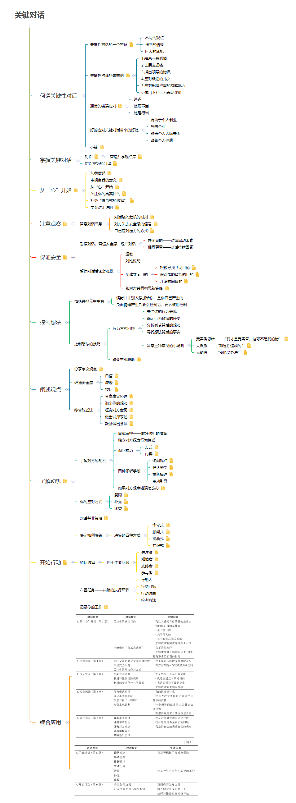

> &ensp;&ensp;&ensp;&ensp;《关键对话》将帮助你以四两拨千斤的方式，利用各种沟通技巧，解决生活中难以应对的各种难题，成就无往不利的事业并拥有更快乐的人生。
&ensp;&ensp;&ensp;&ensp;本书详细剖析了人们在沟通上常见的盲点，并提供了许多立竿见影的谈话、倾听、行动技巧，辅以丰富的对话情境和轻松幽默的小故事，帮助读者以最迅速的方式掌握这些技巧。
&ensp;&ensp;&ensp;&ensp;说的切中要点，让对方清楚知道你的看法，是一种能力；说的圆满得体，让对方自  动反省，是一种智慧。运用本书提供的技巧，不论是多么难以应对的局面，你都能够以事半功倍的效率轻松面对。

<!--more--->

# 1.何谓关键性对话

## 1.1.	关键性对话的三个特征
1.1.1.	不同的观点
1.1.2.	强烈的情绪
1.1.3.	巨大的危机
## 1.2.	关键性对话场景举例
关键性对话往往出现在重要的场合，此时更应该理性处置。
1.2.1.	1.结束一段感情
1.2.2.	2.让朋友还钱
1.2.3.	3.指出领导的错误
1.2.4.	4.应对叛逆的儿女
1.2.5.	5.应对配偶严重的家庭暴力
1.2.6.	6.做出不利行为表现评价
... ...
## 1.3.	通常的错误应对
逃避只能逃避对话，逃避是逃避不了问题的。当我们意识到事态已经升级到关键性对话的时候，沉默往往会造成惨痛的代价。这些代价可能时间上的错失，也可能空间上的隔离。既然问题可以通过对话来解决，那么人们更应该去面对它。就算退一步，对话处理不当，也强过丧失对话的机会。放弃逃避才能在处理不当和处理得当间得到结果。
1.3.1.	逃避
1.3.2.	处理不当
1.3.3.	处理得当
## 1.4.	好的应对关键对话带来的好处
1.4.1.	有助于个人创业
1.4.2.	改善企业
1.4.3.	改善个人人际关系
1.4.4.	改善个人健康
相信每个人都体验过不良的关键对话带内心负面的影响，大家也都明白内心的愉悦与安宁对身体意义。
## 1.5.	小结
当结果充满风险,观点背道而驰，双方的情绪激烈时，普通的对话会升级为关键对话。尽管关键对话对人们意义重大，但是往往应对容易偏差。事实证明，逃避对话或是把对话搞砸都会带来灾难性的后果。所以在后续的章节学习中我们将会学习如何应对关键对话。

